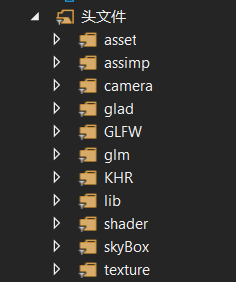

# 16340039 陈星宇

## 项目负责内容

* 搭建项目框架
* 方块渲染与纹理
* 光照模型
* 相机移动
* 模型导入
* 天空盒


### 1. 搭建项目框架

我在项目开始时, 搭建了这次项目的框架.

通过将第三方库放到对应的文件夹, 将实现的功能代码放到头文件中, main文件只通过调用其他功能, 保证了项目框架解耦合.




除此之外, 我还在前期准备时, 负责提供本次项目的图片资源, 包括纹理贴图、粒子图片、模型资源、天空盒贴图等. 


### 2. 方块渲染与纹理

首先定义了Point类和Block类, Block类对应于要渲染的方块, Point类用于在渲染时将Blcok转换为vector\<Point>

```
class Point {
public:
	//	点的三维坐标
	glm::vec3 Position;

	//	点的材质坐标
	glm::vec2 TexCoords;

	//	点的法向量坐标
	glm::vec3 Normal;


	Point(glm::vec3 Position = glm::vec3(0.0f, 0.0f, 0.0f), glm::vec2 TexCoords = glm::vec2(0.0f, 0.0f), glm::vec3 Normal = glm::vec3(0.0f, 0.0f, 0.0f)) {
		this->Position = Position;
		this->TexCoords = TexCoords;
		this->Normal = Normal;
	}
};
```


```
class Block {
public:
	vector<Point> vertices;
	const float blockSize = 1.0f;
	Point center;
	unsigned int textureID;

	//	根据方块中心坐标生成方块的36个顶点坐标
	Block(Point center, char const* textPath) {
		this->center = center;

		textureID = loadBlockTexture(textPath);

		//	正面
		vertices.push_back(Point(glm::vec3(center.Position.x - blockSize / 2, center.Position.y + blockSize / 2, center.Position.z + blockSize / 2), glm::vec2(0.0f, 1.0f), glm::vec3(0.0f, 0.0f, 1.0f)));
		vertices.push_back(Point(glm::vec3(center.Position.x + blockSize / 2, center.Position.y + blockSize / 2, center.Position.z + blockSize / 2), glm::vec2(1.0f, 1.0f), glm::vec3(0.0f, 0.0f, 1.0f)));
		vertices.push_back(Point(glm::vec3(center.Position.x + blockSize / 2, center.Position.y - blockSize / 2, center.Position.z + blockSize / 2), glm::vec2(1.0f, 0.0f), glm::vec3(0.0f, 0.0f, 1.0f)));
		vertices.push_back(Point(glm::vec3(center.Position.x - blockSize / 2, center.Position.y + blockSize / 2, center.Position.z + blockSize / 2), glm::vec2(0.0f, 1.0f), glm::vec3(0.0f, 0.0f, 1.0f)));
		vertices.push_back(Point(glm::vec3(center.Position.x - blockSize / 2, center.Position.y - blockSize / 2, center.Position.z + blockSize / 2), glm::vec2(0.0f, 0.0f), glm::vec3(0.0f, 0.0f, 1.0f)));
		vertices.push_back(Point(glm::vec3(center.Position.x + blockSize / 2, center.Position.y - blockSize / 2, center.Position.z + blockSize / 2), glm::vec2(1.0f, 0.0f), glm::vec3(0.0f, 0.0f, 1.0f)));

		//	后面
		vertices.push_back(Point(glm::vec3(center.Position.x - blockSize / 2, center.Position.y + blockSize / 2, center.Position.z - blockSize / 2), glm::vec2(0.0f, 1.0f), glm::vec3(0.0f, 0.0f, -1.0f)));
		vertices.push_back(Point(glm::vec3(center.Position.x + blockSize / 2, center.Position.y + blockSize / 2, center.Position.z - blockSize / 2), glm::vec2(1.0f, 1.0f), glm::vec3(0.0f, 0.0f, -1.0f)));
		vertices.push_back(Point(glm::vec3(center.Position.x + blockSize / 2, center.Position.y - blockSize / 2, center.Position.z - blockSize / 2), glm::vec2(1.0f, 0.0f), glm::vec3(0.0f, 0.0f, -1.0f)));
		vertices.push_back(Point(glm::vec3(center.Position.x - blockSize / 2, center.Position.y + blockSize / 2, center.Position.z - blockSize / 2), glm::vec2(0.0f, 1.0f), glm::vec3(0.0f, 0.0f, -1.0f)));
		vertices.push_back(Point(glm::vec3(center.Position.x - blockSize / 2, center.Position.y - blockSize / 2, center.Position.z - blockSize / 2), glm::vec2(0.0f, 0.0f), glm::vec3(0.0f, 0.0f, -1.0f)));
		vertices.push_back(Point(glm::vec3(center.Position.x + blockSize / 2, center.Position.y - blockSize / 2, center.Position.z - blockSize / 2), glm::vec2(1.0f, 0.0f), glm::vec3(0.0f, 0.0f, -1.0f)));


		//	左面
		vertices.push_back(Point(glm::vec3(center.Position.x - blockSize / 2, center.Position.y + blockSize / 2, center.Position.z + blockSize / 2), glm::vec2(1.0f, 1.0f), glm::vec3(-1.0f, 0.0f, 0.0f)));
		vertices.push_back(Point(glm::vec3(center.Position.x - blockSize / 2, center.Position.y + blockSize / 2, center.Position.z - blockSize / 2), glm::vec2(0.0f, 1.0f), glm::vec3(-1.0f, 0.0f, 0.0f)));
		vertices.push_back(Point(glm::vec3(center.Position.x - blockSize / 2, center.Position.y - blockSize / 2, center.Position.z + blockSize / 2), glm::vec2(1.0f, 0.0f), glm::vec3(-1.0f, 0.0f, 0.0f)));
		vertices.push_back(Point(glm::vec3(center.Position.x - blockSize / 2, center.Position.y - blockSize / 2, center.Position.z + blockSize / 2), glm::vec2(1.0f, 0.0f), glm::vec3(-1.0f, 0.0f, 0.0f)));
		vertices.push_back(Point(glm::vec3(center.Position.x - blockSize / 2, center.Position.y - blockSize / 2, center.Position.z - blockSize / 2), glm::vec2(0.0f, 0.0f), glm::vec3(-1.0f, 0.0f, 0.0f)));
		vertices.push_back(Point(glm::vec3(center.Position.x - blockSize / 2, center.Position.y + blockSize / 2, center.Position.z - blockSize / 2), glm::vec2(0.0f, 1.0f), glm::vec3(-1.0f, 0.0f, 0.0f)));


		//	右面
		vertices.push_back(Point(glm::vec3(center.Position.x + blockSize / 2, center.Position.y + blockSize / 2, center.Position.z + blockSize / 2), glm::vec2(1.0f, 1.0f), glm::vec3(1.0f, 0.0f, 0.0f)));
		vertices.push_back(Point(glm::vec3(center.Position.x + blockSize / 2, center.Position.y + blockSize / 2, center.Position.z - blockSize / 2), glm::vec2(0.0f, 1.0f), glm::vec3(1.0f, 0.0f, 0.0f)));
		vertices.push_back(Point(glm::vec3(center.Position.x + blockSize / 2, center.Position.y - blockSize / 2, center.Position.z + blockSize / 2), glm::vec2(1.0f, 0.0f), glm::vec3(1.0f, 0.0f, 0.0f)));
		vertices.push_back(Point(glm::vec3(center.Position.x + blockSize / 2, center.Position.y - blockSize / 2, center.Position.z + blockSize / 2), glm::vec2(1.0f, 0.0f), glm::vec3(1.0f, 0.0f, 0.0f)));
		vertices.push_back(Point(glm::vec3(center.Position.x + blockSize / 2, center.Position.y - blockSize / 2, center.Position.z - blockSize / 2), glm::vec2(0.0f, 0.0f), glm::vec3(1.0f, 0.0f, 0.0f)));
		vertices.push_back(Point(glm::vec3(center.Position.x + blockSize / 2, center.Position.y + blockSize / 2, center.Position.z - blockSize / 2), glm::vec2(0.0f, 1.0f), glm::vec3(1.0f, 0.0f, 0.0f)));


		//	上面
		vertices.push_back(Point(glm::vec3(center.Position.x + blockSize / 2, center.Position.y + blockSize / 2, center.Position.z - blockSize / 2), glm::vec2(1.0f, 1.0f), glm::vec3(0.0f, 1.0f, 0.0f)));
		vertices.push_back(Point(glm::vec3(center.Position.x - blockSize / 2, center.Position.y + blockSize / 2, center.Position.z - blockSize / 2), glm::vec2(0.0f, 1.0f), glm::vec3(0.0f, 1.0f, 0.0f)));
		vertices.push_back(Point(glm::vec3(center.Position.x - blockSize / 2, center.Position.y + blockSize / 2, center.Position.z + blockSize / 2), glm::vec2(0.0f, 0.0f), glm::vec3(0.0f, 1.0f, 0.0f)));
		vertices.push_back(Point(glm::vec3(center.Position.x - blockSize / 2, center.Position.y + blockSize / 2, center.Position.z + blockSize / 2), glm::vec2(0.0f, 0.0f), glm::vec3(0.0f, 1.0f, 0.0f)));
		vertices.push_back(Point(glm::vec3(center.Position.x + blockSize / 2, center.Position.y + blockSize / 2, center.Position.z + blockSize / 2), glm::vec2(1.0f, 0.0f), glm::vec3(0.0f, 1.0f, 0.0f)));
		vertices.push_back(Point(glm::vec3(center.Position.x + blockSize / 2, center.Position.y + blockSize / 2, center.Position.z - blockSize / 2), glm::vec2(1.0f, 1.0f), glm::vec3(0.0f, 1.0f, 0.0f)));


		//	下面
		vertices.push_back(Point(glm::vec3(center.Position.x + blockSize / 2, center.Position.y - blockSize / 2, center.Position.z - blockSize / 2), glm::vec2(1.0f, 1.0f), glm::vec3(0.0f, -1.0f, 0.0f)));
		vertices.push_back(Point(glm::vec3(center.Position.x - blockSize / 2, center.Position.y - blockSize / 2, center.Position.z - blockSize / 2), glm::vec2(0.0f, 1.0f), glm::vec3(0.0f, -1.0f, 0.0f)));
		vertices.push_back(Point(glm::vec3(center.Position.x - blockSize / 2, center.Position.y - blockSize / 2, center.Position.z + blockSize / 2), glm::vec2(0.0f, 0.0f), glm::vec3(0.0f, -1.0f, 0.0f)));
		vertices.push_back(Point(glm::vec3(center.Position.x - blockSize / 2, center.Position.y - blockSize / 2, center.Position.z + blockSize / 2), glm::vec2(0.0f, 0.0f), glm::vec3(0.0f, -1.0f, 0.0f)));
		vertices.push_back(Point(glm::vec3(center.Position.x + blockSize / 2, center.Position.y - blockSize / 2, center.Position.z + blockSize / 2), glm::vec2(1.0f, 0.0f), glm::vec3(0.0f, -1.0f, 0.0f)));
		vertices.push_back(Point(glm::vec3(center.Position.x + blockSize / 2, center.Position.y - blockSize / 2, center.Position.z - blockSize / 2), glm::vec2(1.0f, 1.0f), glm::vec3(0.0f, -1.0f, 0.0f)));
	}
}
```


当需要创建不同方块时, 只需通过传入对应的纹理图片名称, 然后加载即可

```
	unsigned int loadBlockTexture(char const* path) {
		unsigned int textureID;
		glGenTextures(1, &textureID);
		glBindTexture(GL_TEXTURE_2D, textureID);
		// 为当前绑定的纹理对象设置环绕、过滤方式
		glTexParameteri(GL_TEXTURE_2D, GL_TEXTURE_WRAP_S, GL_REPEAT);
		glTexParameteri(GL_TEXTURE_2D, GL_TEXTURE_WRAP_T, GL_REPEAT);
		glTexParameteri(GL_TEXTURE_2D, GL_TEXTURE_MIN_FILTER, GL_LINEAR);
		glTexParameteri(GL_TEXTURE_2D, GL_TEXTURE_MAG_FILTER, GL_LINEAR);

		int width, height, nrChannels;
		unsigned char* data = stbi_load(path, &width, &height, &nrChannels, 0);

		glTexImage2D(GL_TEXTURE_2D, 0, GL_RGBA, width, height, 0, GL_RGBA, GL_UNSIGNED_BYTE, data);
		glGenerateMipmap(GL_TEXTURE_2D);

		//	释放图片内存
		stbi_image_free(data);
		return textureID;
	}
```


渲染时, 将相同类型的方块放到同一个vector中, 然后循环渲染, 每轮渲染一个类型的vector. 这样做的好处是减少了VBO传递的次数, 显著提高渲染性能

```
void renderScene() {
	for (int i = 0; i < blocks.size(); i++) {
		//	将vector<Block>转为vector<Point>
		if (!blocks[i].empty()) {
			vector<Point> vertices = blockToPoint(blocks[i]);
			//	绑定blockVAO, blockVBO(若有多个VAO, VBO, 在传入缓冲前要先绑定VAO, VBO)
			glBindVertexArray(blockVAO);
			glGenBuffers(1, &blockVBO);
			glBindBuffer(GL_ARRAY_BUFFER, blockVBO);
			glBufferData(GL_ARRAY_BUFFER, sizeof(Point) * vertices.size(), &vertices[0], GL_STATIC_DRAW);

			//	设置位置属性
			glVertexAttribPointer(0, 3, GL_FLOAT, GL_FALSE, 8 * sizeof(float), (void*)0);
			glEnableVertexAttribArray(0);

			//	设置纹理属性
			glVertexAttribPointer(1, 2, GL_FLOAT, GL_FALSE, 8 * sizeof(float), (void*)offsetof(Point, TexCoords));
			glEnableVertexAttribArray(1);

			//	设置法向量属性
			glVertexAttribPointer(2, 3, GL_FLOAT, GL_FALSE, 8 * sizeof(float), (void*)offsetof(Point, Normal));
			glEnableVertexAttribArray(2);


			//	激活Block纹理并绘制Block
			glActiveTexture(GL_TEXTURE0);
			glBindTexture(GL_TEXTURE_2D, blocks[i][0]->textureID);
			glDrawArrays(GL_TRIANGLES, 0, vertices.size());
		}
	}
}
```


### 3. 光照模型

我使用Phong Light Model创建点光源, 放置在SkyBox的太阳处. 


phong光照模型由环境（Ambient）、漫反射（Diffuse）以及镜面（Sepcular）光照组成。

- 环境光照会改变光照的强度，实现物体的明暗效果
- 漫反射以及镜面光照则改变物体受光照的影响
  - 漫反射分量越大，物体对着光源的那部分就会越亮
  - 镜面光照分量越大则物体反光能力越强（越容易在物体表面上出现亮点）


**顶点着色器**

```
#version 330 core

layout (location = 0) in vec3 aPos;
layout (location = 1) in vec2 aTexCoord;
layout (location = 2) in vec3 aNormal;

uniform mat4 model;
uniform mat4 view;
uniform mat4 projection;
uniform mat4 lightSpaceMatrix;

out vec2 TexCoord;
out vec3 FragPos;
out vec3 Normal;
out vec4 FragPosLightSpace;

void main(){
    gl_Position = projection * view * model * vec4(aPos, 1.0);
	TexCoord = aTexCoord;
	FragPos = vec3(model * vec4(aPos, 1.0));
    Normal = mat3(transpose(inverse(model))) * aNormal; 
	FragPosLightSpace = lightSpaceMatrix * vec4(FragPos, 1.0);
};
```


**片段着色器**

```
#version 330 core

in vec2 TexCoord;
in vec3 Normal;  
in vec3 FragPos; 
in vec4 FragPosLightSpace;

out vec4 FragColor;

uniform sampler2D ourTexture;
uniform sampler2D shadowMap;

uniform float ambientStrength;
uniform float diffuseStrength;
uniform float specularStrength; 
uniform int ShininessStrength;

uniform vec3 lightPos; 
uniform vec3 objectColor;
uniform vec3 lightColor;
uniform vec3 viewPos; 

float ShadowCalculation(vec4 fragPosLightSpace)
{
    // perform perspective divide
    vec3 projCoords = fragPosLightSpace.xyz / fragPosLightSpace.w;
    // transform to [0,1] range
    projCoords = projCoords * 0.5 + 0.5;
    // get closest depth value from light's perspective (using [0,1] range fragPosLight as coords)
    float closestDepth = texture(shadowMap, projCoords.xy).r; 
    // get depth of current fragment from light's perspective
    float currentDepth = projCoords.z;
    // calculate bias (based on depth map resolution and slope)
    vec3 normal = normalize(Normal);
    vec3 lightDir = normalize(lightPos - FragPos);
    float bias = max(0.05 * (1.0 - dot(normal, lightDir)), 0.005);
    // check whether current frag pos is in shadow
    // float shadow = currentDepth - bias > closestDepth  ? 1.0 : 0.0;
    // PCF
    float shadow = 0.0;
    vec2 texelSize = 1.0 / textureSize(shadowMap, 0);
    for(int x = -1; x <= 1; ++x)
    {
        for(int y = -1; y <= 1; ++y)
        {
            float pcfDepth = texture(shadowMap, projCoords.xy + vec2(x, y) * texelSize).r; 
            shadow += currentDepth - bias > pcfDepth  ? 1.0 : 0.0;        
        }    
    }
    shadow /= 9.0;
    
    // keep the shadow at 0.0 when outside the far_plane region of the light's frustum.
    if(projCoords.z > 1.0)
        shadow = 0.0;
        
    return shadow;
}

void main() {
	vec3 color = texture(ourTexture, TexCoord).rgb;
	vec3 norm = normalize(Normal);
	//环境光
    vec3 ambient = ambientStrength * color;
	//漫反射
	vec3 lightDir = normalize(lightPos - FragPos);
	float diff = max(dot(norm, lightDir), 0.0);
	vec3 diffuse = diffuseStrength * diff * lightColor;

	//镜面光
	vec3 viewDir = normalize(viewPos - FragPos);
	vec3 reflectDir = reflect(-lightDir, norm);  
	vec3 halfwayDir = normalize(lightDir + viewDir);  
	float spec = pow(max(dot(norm, halfwayDir), 0.0), ShininessStrength);
	vec3 specular = specularStrength * spec * lightColor;  

	float shadow = ShadowCalculation(FragPosLightSpace);  
	vec3 lighting = (ambient + (1.0 - shadow) * (diffuse + specular)) * color;    

    FragColor = vec4(lighting, 1.0);
};
```


### 4. 相机移动

封装了一个 Camera 类, 支持视角移动以及缩放


**初始化属性值**

```
// 相机的位置
glm::vec3 Position = glm::vec3(0.0f, 2.0f, 0.0f);
// 相机的前向量
glm::vec3 Front = glm::vec3(1.0f, 0.0f, 0.0f);
// 相机的上向量
glm::vec3 Up = glm::vec3(0.0f, 1.0f, 0.0f);
// 相机的右向量
glm::vec3 Right;
// 观察坐标
glm::vec3 WorldUp = glm::vec3(0.0f, 0.0f, 0.0f);
```


**视角移动**

我们利用欧拉角（Euler Angle），通过在3D空间中旋转的三个值（pitch, yaw, roll）进行视角的移动。利用它们的结合，我们可以算出3D空间中的任何旋转的向量。


如果我们在xz平面上，向y轴看去，我们可以计算其长度y方向的强度（Strength）。对于给定的俯仰角theta，我们可以使用语句表示：

```
direction.y = sin(glm::radians(pitch));
```

同样地，我们需要更新x与z分量：

```
direction.x = cos(glm::radians(pitch));
direction.z = cos(glm::radians(pitch));
```


**实现按键的移动**

我们通过跟踪一个时间差（Deltatime），把所有速度乘以这个`deltaTime`值，可以调整移动速度。如果`deltaTime`值很大，那么上一帧渲染花费更多的时间，所以这一帧需要更高的速度进行平衡。

```
	void ProcessKeyboard(Camera_Movement direction, float deltaTime)
	{
		// 间隔时间是每一帧的间隔时间,为了使移动更平滑
		float velocity = MovementSpeed * deltaTime;
		if (direction == FORWARD)
			Position += Front * velocity;
		if (direction == BACKWARD)
			Position -= Front * velocity;
		if (direction == LEFT)
			Position -= Right * velocity;
		if (direction == RIGHT)
			Position += Right * velocity;
	}
```


### 5. 模型导入

这里使用的是最为流行的Assimp作为我们的模型导入库. 主要是通过实现mesh和model类，其中mesh是网格，本身包含了渲染所需要的所有相关数据，像是顶点位置、法向量、纹理坐标、面(Face)和物体的材质。


```
vector<Vertex> vertices;
vector<unsigned int> indices;
vector<Texture> textures;
unsigned int VAO;
void Draw(Shader* shader) {
		shader->setVec3("light.ambient", glm::vec3(0));
		shader->setVec3("light.diffuse", glm::vec3(0));
		shader->setVec3("light.specular", glm::vec3(0));
		shader->setFloat("light.shininess", 32);
		shader->setInt("material.specular", 0);
		shader->setInt("material.diffuse", 0);
		shader->setInt("material.normal", 0);
		shader->setInt("material.height", 0);
		bool hasColor = false;
		bool hasTexture = false;
		for (unsigned int i = 0; i < textures.size(); i++) {
			string name = textures[i].type;
			if (name == "color") {
				hasColor = true;
				shader->setVec3("light.ambient", textures[i].ambientColor);
				shader->setVec3("light.diffuse", textures[i].diffuseColor);
				shader->setVec3("light.specular", textures[i].specularColor);
				if (textures[i].shininess != 0) {
					shader->setFloat("light.shininess", textures[i].shininess);
				}
			}
			else {
				hasTexture = true;
				glActiveTexture(GL_TEXTURE0 + i);
				shader->setInt(name.c_str(), i);
				glBindTexture(GL_TEXTURE_2D, textures[i].id);
			}
		}
		shader->setInt("hasColor", hasColor);
		shader->setInt("hasTexture", hasTexture);

		glBindVertexArray(VAO);
		glDrawElements(GL_TRIANGLES, indices.size(), GL_UNSIGNED_INT, 0);
		glBindVertexArray(0);

		glActiveTexture(GL_TEXTURE0);
	}
```

上述代码存储了模型的基本信息。Draw用于绘制mesh。

```
class Model 
{
    public:
        /*  函数   */
        Model(char *path)
        {
            loadModel(path);
        }
        void Draw(Shader shader);   
    private:
        /*  模型数据  */
        vector<Mesh> meshes;
        string directory;
        /*  函数   */
        void loadModel(string path);
        void processNode(aiNode *node, const aiScene *scene);
        Mesh processMesh(aiMesh *mesh, const aiScene *scene);
        vector<Texture> loadMaterialTextures(aiMaterial *mat, aiTextureType type, 
                                             string typeName);
};
```

Model类包含了一个Mesh对象的vector，Draw函数就是遍历了所有网格，并调用mesh各自的Draw函数。processMesh函数用于访问网格的相关属性，并将它们储存到我们对象中。


### 6. 天空盒

天空盒通过立方体贴图实现


通过六个面的填空图像合成一个天空盒，在渲染的时候，我们需要天空盒显示在所有物体的后面，一个方法是一开始先渲染天空盒，但是在一般情况下，天空盒只是有少部分是可见的。因此这里使用了提前深度测试来丢弃片段，最后才渲染天空盒。

在着色器中，把天空盒的 w 分量调成`1`

```
void main() {
    TexCoords = aPos;
    vec4 pos = projection * view * vec4(aPos, 1.0);
    gl_Position = pos.xyww;
}
```


需要把深度测试的方式改成`GL_LEQUAL`，表示在片段深度值小于等于缓冲区的深度值时通过测试，这样天空盒就会被认为是最后面的

```
glDepthFunc(GL_LEQUAL);
this->skyShader->Use();
glBindVertexArray(skyboxVAO);
glActiveTexture(GL_TEXTURE0);
glBindTexture(GL_TEXTURE_CUBE_MAP, this->skyBox->ID);
glDrawArrays(GL_TRIANGLES, 0, 36);
glBindVertexArray(0);
glDepthFunc(GL_LESS);
```

最后把深度测试方式调回默认的`GL_LESS`


## 个人总结

  这次计图期末项目，我主要负责搭建项目框架、方块渲染与纹理、光照模型、相机移动、模型导入、天空盒.
  因为平时对于Mine Craft这款游戏比较喜欢, 所以在听说要做一个期末项目时, 提议选择做这个. 在前期的时候, 也是比较有干劲, 马上搭建了项目的框架, 还从MC中获取了贴图包. 

  在做相机、光照这两部分的时候, 没有什么难度, 因为是以前实现过的. 天空盒与模型导入网上有教程, 照着教程来实现起来也不是特别麻烦, 也就不特别赘述了.
  最终的项目由大家共同完成，与预期的效果还是比较接近的，就我自己来说十分满意。整个学期的计图课程也告一段落，从课上的理论学习到课外的实践，我学到了不少东西，也从合作中收获了不少，