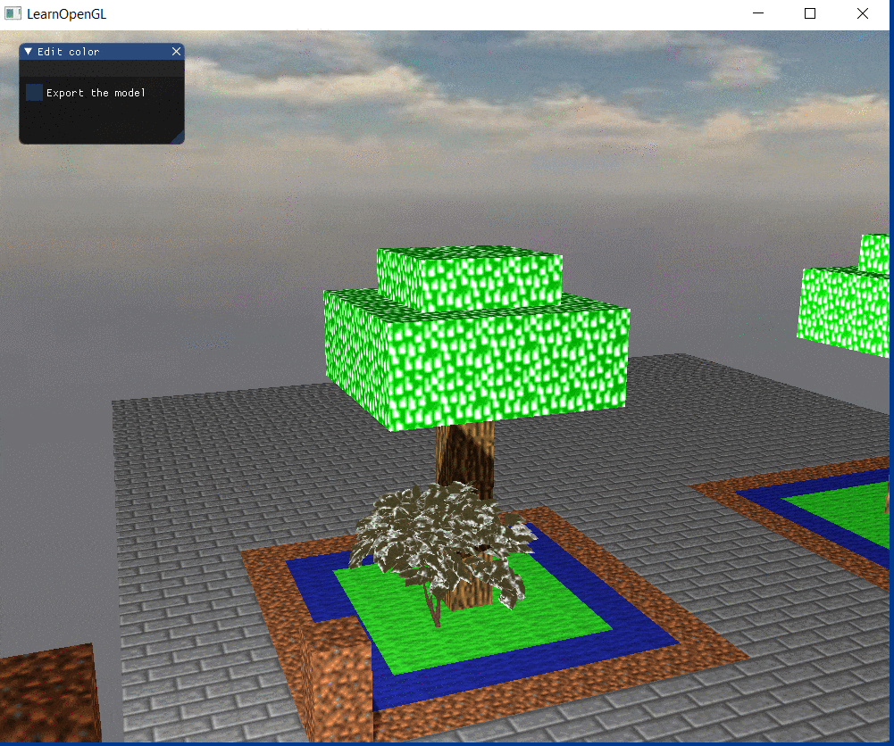
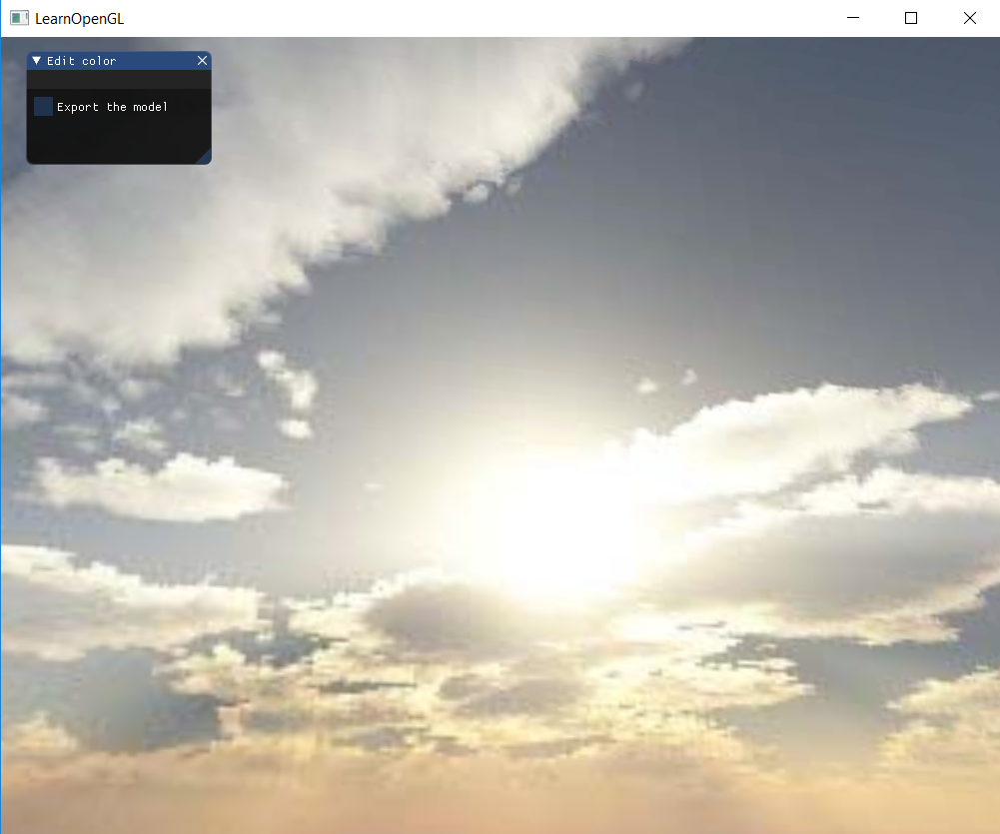
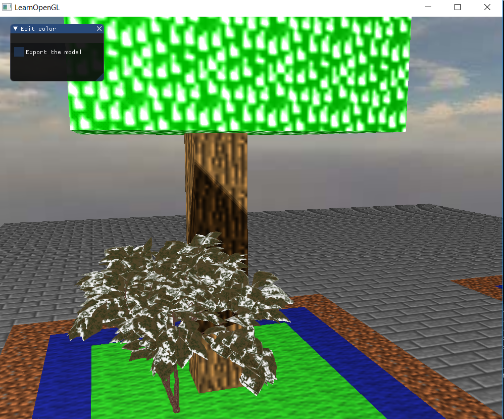

# 期末项目报告

## 小组成员分工

| 姓名   | 学号     | 分工                                                         |
| ------ | -------- | ------------------------------------------------------------ |
| 陈伟桐 | 16340034 | 项目场景搭建、阴影和抗锯齿、爆炸效果                         |
| 陈星宇 | 16340039 | 搭建项目框架、方块渲染与纹理、光照模型、相机移动、模型导入、天空盒、获取图片资源(纹理贴图、天空盒、模型资源) |
| 陈彦行 | 16340043 | 方块的添加与删除、重力系统与碰撞检测                         |

## 项目介绍
我们的项目是做一个类似于我的世界的一个游戏，这个游戏世界主要由一个个方块构成，不同方块的组合可以构成各式各样的建筑和场景。玩家可以通过“背包”选择不同的方块进行添加，也可以任意破环游戏世界中的方块。

这个游戏的主要功能为：可以选择不同的方块并在场景中添加该方块，可以破坏场景中的方块、摄像机视角的自由移动、光照与阴影、方块纹理贴图、模型的导入、天空盒、文字的显示、重力系统与碰撞检测、雨雪粒子系统、特殊方块的爆炸效果、抗锯齿。

## 实现结果
项目实现结果如本目录下的演示视频所示。

## 开发环境及第三方库
本项目的开发在 windows 系统下进行，使用的编辑器是 visual studio 2017，sdk 版本取决于开发成员本地 sdk 版本，解决方案平台为 `x86`。

本项目使用的第三方库：
- glfw3
- glad
- glm
- imgui
- assimp
- freetype
- stb_image

## 功能列表
本项目实现的功能列表如下：

### Basic
- Camera Roaming
- Simple lighting and shading(phong)
- Texture mapping
- Shadow mapping
- Model import & Mesh viewing

### Bonus
- Sky Box (天空盒)
- Display Text (显示文字，中文/英文/立体/平面)<font color=#FF8C00>（未完成）</font>
- Gravity System and Collision Detection (重力系统与碰撞检测)<font color=#FF8C00>（未完成）</font>
- Particle System (粒子系统: 渲染雨、雪、雾等)<font color=#FF8C00>（未完成）</font>
- Explosion Effect (爆炸效果)<font color=#FF8C00>（未完成）</font>
- Anti-Aliasing (抗锯齿)


## 功能介绍

### Camera Roaming

封装了一个 Camera 类, 支持视角移动以及缩放




**初始化属性值**

```
// 相机的位置
glm::vec3 Position = glm::vec3(0.0f, 2.0f, 0.0f);
// 相机的前向量
glm::vec3 Front = glm::vec3(1.0f, 0.0f, 0.0f);
// 相机的上向量
glm::vec3 Up = glm::vec3(0.0f, 1.0f, 0.0f);
// 相机的右向量
glm::vec3 Right;
// 观察坐标
glm::vec3 WorldUp = glm::vec3(0.0f, 0.0f, 0.0f);
```


**视角移动**

我们利用欧拉角（Euler Angle），通过在3D空间中旋转的三个值（pitch, yaw, roll）进行视角的移动。利用它们的结合，我们可以算出3D空间中的任何旋转的向量。


如果我们在xz平面上，向y轴看去，我们可以计算其长度y方向的强度（Strength）。对于给定的俯仰角theta，我们可以使用语句表示：

```
direction.y = sin(glm::radians(pitch));
```

同样地，我们需要更新x与z分量：

```
direction.x = cos(glm::radians(pitch));
direction.z = cos(glm::radians(pitch));
```


**实现按键的移动**

我们通过跟踪一个时间差（Deltatime），把所有速度乘以这个`deltaTime`值，可以调整移动速度。如果`deltaTime`值很大，那么上一帧渲染花费更多的时间，所以这一帧需要更高的速度进行平衡。

```
	void ProcessKeyboard(Camera_Movement direction, float deltaTime)
	{
		// 间隔时间是每一帧的间隔时间,为了使移动更平滑
		float velocity = MovementSpeed * deltaTime;
		if (direction == FORWARD)
			Position += Front * velocity;
		if (direction == BACKWARD)
			Position -= Front * velocity;
		if (direction == LEFT)
			Position -= Right * velocity;
		if (direction == RIGHT)
			Position += Right * velocity;
	}
```


### Light

使用Phong Light Model创建点光源, 放置在SkyBox的太阳处




phong光照模型由环境（Ambient）、漫反射（Diffuse）以及镜面（Sepcular）光照组成。

- 环境光照会改变光照的强度，实现物体的明暗效果
- 漫反射以及镜面光照则改变物体受光照的影响
  - 漫反射分量越大，物体对着光源的那部分就会越亮
  - 镜面光照分量越大则物体反光能力越强（越容易在物体表面上出现亮点）


### SkyBox

天空盒通过立方体贴图实现


通过六个面的填空图像合成一个天空盒，在渲染的时候，我们需要天空盒显示在所有物体的后面，一个方法是一开始先渲染天空盒，但是在一般情况下，天空盒只是有少部分是可见的。因此这里使用了提前深度测试来丢弃片段，最后才渲染天空盒。

在着色器中，把天空盒的 w 分量调成`1`

```
void main() {
    TexCoords = aPos;
    vec4 pos = projection * view * vec4(aPos, 1.0);
    gl_Position = pos.xyww;
}
```


需要把深度测试的方式改成`GL_LEQUAL`，表示在片段深度值小于等于缓冲区的深度值时通过测试，这样天空盒就会被认为是最后面的

```
glDepthFunc(GL_LEQUAL);
this->skyShader->Use();
glBindVertexArray(skyboxVAO);
glActiveTexture(GL_TEXTURE0);
glBindTexture(GL_TEXTURE_CUBE_MAP, this->skyBox->ID);
glDrawArrays(GL_TRIANGLES, 0, 36);
glBindVertexArray(0);
glDepthFunc(GL_LESS);
```

最后把深度测试方式调回默认的`GL_LESS`


### Block Render

我们使用的方块都是标准的立方体, 对于不同种类的方块, 只需要传入不同的纹理即可.


自定义Point类, Block类

```
class Point {
	...
};


class Block {
	...
};
```


在Block类中加载对应的纹理

```
	//	加载Block纹理
	unsigned int loadBlockTexture(char const* path) {
		unsigned int textureID;
		glGenTextures(1, &textureID);
		glBindTexture(GL_TEXTURE_2D, textureID);
		// 为当前绑定的纹理对象设置环绕、过滤方式
		glTexParameteri(GL_TEXTURE_2D, GL_TEXTURE_WRAP_S, GL_REPEAT);
		glTexParameteri(GL_TEXTURE_2D, GL_TEXTURE_WRAP_T, GL_REPEAT);
		glTexParameteri(GL_TEXTURE_2D, GL_TEXTURE_MIN_FILTER, GL_LINEAR);
		glTexParameteri(GL_TEXTURE_2D, GL_TEXTURE_MAG_FILTER, GL_LINEAR);

		int width, height, nrChannels;
		unsigned char* data = stbi_load(path, &width, &height, &nrChannels, 0);

		glTexImage2D(GL_TEXTURE_2D, 0, GL_RGBA, width, height, 0, GL_RGBA, GL_UNSIGNED_BYTE, data);
		glGenerateMipmap(GL_TEXTURE_2D);

		//	释放图片内存
		stbi_image_free(data);
		return textureID;
	}
```


渲染时将Block转换为Point

```
vector<Point> blockToPoint(vector<Block*> blocks) {
	vector<Point> vertices;
	for (int i = 0; i < blocks.size(); i++) {
		vertices.insert(vertices.end(), blocks[i]->vertices.begin(), blocks[i]->vertices.end());
	}

	return vertices;
}
```


相同种类的方块放在同一个vector中, 因此全部的方块使用vector<vector\<>>保存m, 然后分批次传递给VBO

```
void renderScene() {
	for (int i = 0; i < blocks.size(); i++) {
		//	将vector<Block>转为vector<Point>
		if (!blocks[i].empty()) {
			vector<Point> vertices = blockToPoint(blocks[i]);
			//	绑定blockVAO, blockVBO(若有多个VAO, VBO, 在传入缓冲前要先绑定VAO, VBO)
			glBindVertexArray(blockVAO);
			glGenBuffers(1, &blockVBO);
			glBindBuffer(GL_ARRAY_BUFFER, blockVBO);
			glBufferData(GL_ARRAY_BUFFER, sizeof(Point) * vertices.size(), &vertices[0], GL_STATIC_DRAW);

			//	设置位置属性
			glVertexAttribPointer(0, 3, GL_FLOAT, GL_FALSE, 8 * sizeof(float), (void*)0);
			glEnableVertexAttribArray(0);

			//	设置纹理属性
			glVertexAttribPointer(1, 2, GL_FLOAT, GL_FALSE, 8 * sizeof(float), (void*)offsetof(Point, TexCoords));
			glEnableVertexAttribArray(1);

			//	设置法向量属性
			glVertexAttribPointer(2, 3, GL_FLOAT, GL_FALSE, 8 * sizeof(float), (void*)offsetof(Point, Normal));
			glEnableVertexAttribArray(2);


			//	激活Block纹理并绘制Block
			glActiveTexture(GL_TEXTURE0);
			glBindTexture(GL_TEXTURE_2D, blocks[i][0]->textureID);
			glDrawArrays(GL_TRIANGLES, 0, vertices.size());
		}
	}
}
```


### Model import

这里使用的是最为流行的Assimp作为我们的模型导入库. 主要是通过实现mesh和model类，其中mesh是网格，本身包含了渲染所需要的所有相关数据，像是顶点位置、法向量、纹理坐标、面(Face)和物体的材质。





```
vector<Vertex> vertices;
vector<unsigned int> indices;
vector<Texture> textures;
unsigned int VAO;
void Draw(Shader* shader) {
		shader->setVec3("light.ambient", glm::vec3(0));
		shader->setVec3("light.diffuse", glm::vec3(0));
		shader->setVec3("light.specular", glm::vec3(0));
		shader->setFloat("light.shininess", 32);
		shader->setInt("material.specular", 0);
		shader->setInt("material.diffuse", 0);
		shader->setInt("material.normal", 0);
		shader->setInt("material.height", 0);
		bool hasColor = false;
		bool hasTexture = false;
		for (unsigned int i = 0; i < textures.size(); i++) {
			string name = textures[i].type;
			if (name == "color") {
				hasColor = true;
				shader->setVec3("light.ambient", textures[i].ambientColor);
				shader->setVec3("light.diffuse", textures[i].diffuseColor);
				shader->setVec3("light.specular", textures[i].specularColor);
				if (textures[i].shininess != 0) {
					shader->setFloat("light.shininess", textures[i].shininess);
				}
			}
			else {
				hasTexture = true;
				glActiveTexture(GL_TEXTURE0 + i);
				shader->setInt(name.c_str(), i);
				glBindTexture(GL_TEXTURE_2D, textures[i].id);
			}
		}
		shader->setInt("hasColor", hasColor);
		shader->setInt("hasTexture", hasTexture);

		glBindVertexArray(VAO);
		glDrawElements(GL_TRIANGLES, indices.size(), GL_UNSIGNED_INT, 0);
		glBindVertexArray(0);

		glActiveTexture(GL_TEXTURE0);
	}
```

上述代码存储了模型的基本信息。Draw用于绘制mesh。

```
class Model 
{
    public:
        /*  函数   */
        Model(char *path)
        {
            loadModel(path);
        }
        void Draw(Shader shader);   
    private:
        /*  模型数据  */
        vector<Mesh> meshes;
        string directory;
        /*  函数   */
        void loadModel(string path);
        void processNode(aiNode *node, const aiScene *scene);
        Mesh processMesh(aiMesh *mesh, const aiScene *scene);
        vector<Texture> loadMaterialTextures(aiMaterial *mat, aiTextureType type, 
                                             string typeName);
};
```

Model类包含了一个Mesh对象的vector，Draw函数就是遍历了所有网格，并调用mesh各自的Draw函数。processMesh函数用于访问网格的相关属性，并将它们储存到我们对象中。


### Shadow mapping
对于阴影(Shadow mapping)，我们使用的是传统的阴影映射方法。


在深度测试中，在深度缓冲里的一个值是摄像机视角下，对应于一个片元的一个0到1之间的深度值。我们从光源的透视图来渲染场景，并把深度值的结果储存到纹理中，这样就能对光源的透视图所见的最近的深度值进行采样。最终，深度值就会显示从光源的透视图下见到的第一个片元了。我们管储存在纹理中的所有这些深度值，叫做深度贴图或阴影贴图。

利用每个片元的深度值，我们可比较在同一条光线上的点谁距离光源更近，距离最近的点是可视的被光线照射的点，而距离较远的则被视为阴影。

为了实现阴影映射，我们首先需要生成一张深度贴图。深度贴图是从光的透视图里渲染的深度纹理。然后把生成的深度纹理作为帧缓冲的深度缓冲，之后生成深度贴图。最后便是阴影的计算，这部分在片段着色器进行，如下：
```
float ShadowCalculation(vec4 fragPosLightSpace)
{
    vec3 projCoords = fragPosLightSpace.xyz / fragPosLightSpace.w;
    projCoords = projCoords * 0.5 + 0.5;
    float closestDepth = texture(shadowMap, projCoords.xy).r; 
    float currentDepth = projCoords.z;
    vec3 normal = normalize(fs_in.Normal);
    vec3 lightDir = normalize(lightPos - fs_in.FragPos);
    float bias = max(0.05 * (1.0 - dot(normal, lightDir)), 0.005);
    float shadow = 0.0;
    vec2 texelSize = 1.0 / textureSize(shadowMap, 0);
    for(int x = -1; x <= 1; ++x)
    {
        for(int y = -1; y <= 1; ++y)
        {
            float pcfDepth = texture(shadowMap, projCoords.xy + vec2(x, y) * texelSize).r; 
            shadow += currentDepth - bias > pcfDepth  ? 1.0 : 0.0;        
        }    
    }
    shadow /= 9.0;
    
    if(projCoords.z > 1.0)
        shadow = 0.0;
        
    return shadow;
}
```

最终的效果如下：


## 个人报告

* [16340039陈星宇](个人报告/16340039_Report.md)

